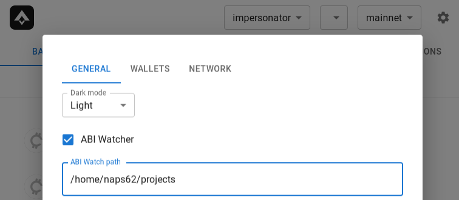

import forge_abis from './forge-abis.mp4';

# Instant Foundry ABI Explorer

While working on mainnet, a lot of people rely on [Etherscan](https://etherscan.io/) to view & interact with contracts. That’s in large part due to their built-in explorer, which gives us a handy way to Read/Write to any contract that has previously been verified.

For local development (via [Foundry](https://getfoundry.sh/), [Hardhat](https://hardhat.org/), or others) you’re out of options though.

Wether you’re writing the contracts, or the UI for your protocol, the ability to explore and interact with your local contracts similarly to Etherscan would be a killer feature.

So we did it. And this is how.

<Video autoPlay controls src={forge_abis} />

## Filesystem tracking

The magic happens in our `iron-forge` [crate](https://github.com/iron-wallet/iron/tree/3a33e1c2f70c169f34d7a9f6b5b365b1f457f7ba/crates/forge).

Since this behavior relies on filesystem monitoring, we make opt-in rather than opt-out. This is due to potential concerns users may have with us snooping into their filesystem, and because we need to give control over which path to scan:



Enabling the ABI watcher, along with a watch path, will cause Iron to listen to filesystem events under that path.

We’re interested only in events related to Foundry’s compilation outputs. By default, those have the format `<project>/out/<Contract>.sol/<Contract>json`

So whenever a file matching such a path is modified/deleted, we immediately update our in-memory index.

We also do some additional parsing, to ensure the file is of the expected format (and not a false-positive), and to extract ABI information.

## On-chain bytecode

Iron already was anvil-aware since the very first version.

We track all transaction traces, to not only construct your account state (balances, transaction history) but also to detect newly deployed smart contracts.

Doing this via traces allows us to detect not only plain contract deploy transactions but also internal ones triggering new \`CREATE\` and \`CREATE2\` opcodes. With [\`ethers-rs\`](https://github.com/gakonst/ethers-rs), this becomes trivial:

```rust
async fn expand_trace(trace: Trace, provider: &Provider<Http>) -> Result<Vec<Event>> {
    let events = match trace {
        // detecting contract deploys
        Trace {
            action: Action::Create(Create { from, value, .. }),
            result: Some(Res::Create(CreateResult { address, .. })),
            ..
        } => {
            // a contract deploy was detected!
            ContractDeployed {
                address,
                code: provider.get_code(address, None).await.ok(),
            }
            .into(),
        }
        
        // other detectors...
```

Notice we also run `eth_getCode`. This is used to later match on-chain contracts with the corresponding ABIs we compiled above. But how can we do that if all we have is bytecode?

## Matching ABIs - Naive version

What Etherscan does is something too complex for our use case: they expect to have the full source code, exact compiler version used, and full constructor arguments given during deployment. By running the exact same compilation & deployment process, they should end up with the same bytecode, thus verifying that the ABI for the given source does indeed match the contract.

Instead, we started with a much simpler solution: we already have the final bytecode from the Foundry output:

```Contract.json
{
  "abi": [
     ...
  ],
  "bytecode": {
    "object": "0x60a06040523480156...",
  },
  "deployedBytecode": {
    "object": "0x60806040523480156...",
  }
 }
```

The `deployedBytecode` the field should match the on-chain code we got from `eth_getCode`, right?

**Narrator**: it would not.

Oh... how so?

## Many different bytecodes

You may have heard about Initialization bytecode and Runtime bytecode (or other variations of those names).

That's because, to deploy a contract on EVM, a snippet of bytecode is executed, which will return the runtime code to the EVM. Constructor arguments also need to be included somehow, even though they're not stored as part of the final bytecode itself.

[This great article](https://monokh.com/posts/ethereum-contract-creation-bytecode) provides a complete explanation of this process if you're curious.

When Foundry builds our contracts, it doesn't have any context of what the constructor arguments will be. And similarly, it doesn't know the final value of `immutable` slots, since those depend on those same arguments.

Here's a complete example of a small contract, and its corresponding output bytecode:

```solidity
pragma solidity ^0.8.13;

contract Immutable {
    uint256 constant foo2 = 100;
    uint256 immutable foo;

    constructor(uint256 _foo) {
        foo = _foo;
    }

    function get() external view returns (uint256) {
        return foo;
    }
}
```

```
0x6080604052348015600f57600080fd5b506004361060285760003560e01c80636d4ce63c14602d575b600080fd5b7f000000000000000000000000000000000000000000000000000000000000000060405190815260200160405180910390f3fea26469706673582212206f04587d461cb9f9fe7b19bf7852e50cc53895de0dac97be2d89329df50e452c64736f6c63430008140033
```

Notice the suspicious string of `00`s somewhere in there? Those correspond to the 256-bits where the value for `foo` will eventually go, once the `constructor` is executed.

This is a nice trick by Solidity to create more gas-optimized contracts, but it does mess a bit with our ability to match against on-chain bytecode.

In the end, it turns out a simple & elegant solution already existed on the Foundry codebase itself (thanks to [Matt Solomon](https://twitter.com/msolomon44) who shared it):

```rust
pub fn diff_score(a: &[u8], b: &[u8]) -> f64 {
    let cutoff_len = usize::min(a.len(), b.len());
    if cutoff_len == 0 {
        return 1.0;
    }

    let a = &a[..cutoff_len];
    let b = &b[..cutoff_len];
    let mut diff_chars = 0;
    for i in 0..cutoff_len {
        if a[i] != b[i] {
            diff_chars += 1;
        }
    }
    diff_chars as f64 / cutoff_len as f64
}
```

This will compare two bytecode snippets, and compute how different they are. Since contract logic is typically large enough to out-weight the bytecode length of all immutables, it's sufficient to consider any contract with a difference of < 10% to be a match. As described in the [original code](https://github.com/foundry-rs/foundry/blob/02e430c20fb7ba1794f5cabdd7eb73182baf4e7e/common/src/contracts.rs#L96-L114), this should only be expected to fail for contracts that are essentially only immutable variables, which are unlikely to be found in real-world usage.

## Next up

One glaring omission we don’t support yet are Proxy contracts. Those will be a challenge on their own, but one we expect to tackle pretty soon. Stay tuned!
