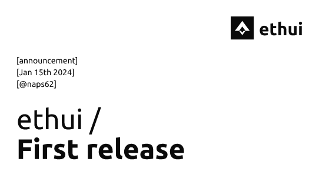

# Announcing ethui

We are launching a developer-centric crypto wallet to give web3 developers the tools they deserve.

<Embed url="https://github.com/iron-wallet/iron/releases/tag/v0.1.0" />

## TL;DR

If you’re a developer or any type of Ethereum power user, this will likely interest you.

Iron is a crypto wallet built, from the ground up, with development & debugging in mind. It bundles together features that, as of now, exist only as loose CLI tools and 3rd party websites and, guess what? It all runs locally on your device, with fully open-source code.

The initial version is already incredibly more powerful than alternatives as a companion to the [Foundry](https://getfoundry.sh/) toolkit. Read on for the list of current features and to get updated on what’s next.

Our aim is to make this as community-driven as possible, so your feedback and suggestions are the most important thing right now.

## Yet another wallet?

This project was born out of frustrations with existing tooling.

When working with diverse teams, where not everyone is an EVM expert – think frontend developers, product managers, or newcomers to the blockchain space – it becomes clear that a lot of tooling already exists, but often in a very loose and low-level way, accessible mostly to the experts.

We want to address this problem by making all of these tools accessible directly from the wallet, with the speed and intuitiveness we’ve come to expect from other tools. Our wallet is what sits between us and a blockchain. As developers, we need it to be helpful, not a hindrance.

The current offering of wallets is unfortunately subpar in several ways. [MetaMask](https://metamask.io/) suffers from various UX issues, and from being stuck in the browser’s sandbox. Snaps are mostly a band-aid with a fair number of limitations themselves. [Frame](https://frame.sh/) proves the advantage of an OS-level wallet and brings the welcome addition of OmniChain routing, but the advantages mostly stop there.

Not to throw any shade on projects such as MetaMask – huge respect for their team and for all their contributions, a lot of which are powering this project as well – but we can and should do better on what comes to developer tools.

## What does it do?

First of all, in good ol’ Rust fashion, it’s blazingly fast. Here’s a NFT minting demo running on `anvil`:

<Youtube id="dq-lue-9Z9E" />

Other than basic wallet features, the bulk of the work so far was focused on a tight integration with [Foundry](https://getfoundry.sh/), specifically:

1. Instant detection of chain restarts/reverts. Fully re-syncs local data (transaction history, balances, and most importantly, nonces);

2. Instant detection of smart contract deploys. This works via transaction traces, so even internal transaction deploys are indexed;

3. Filesystem monitoring, to automatically index known ABIs found within foundry projects;

4. Built-in contract explorer & interaction UI (built from same ABIs);

5. No password-protection or confirmation popups when using anvil with a development wallet;

It also provides a native desktop experience (e.g. keyboard shortcuts, minimize to system tray, contextual menus) and most importantly … dark mode!

## Soon

There are two key features we want to launch on the next iteration:

* Support for encrypted (not plaintext) wallets. Initially from a JSON keystore file, but with other formats, such as GPG & hardware wallets, soon to come. The initial work for this is [nearly ready](https://github.com/iron-wallet/iron/pull/185);

* Integration with a 3rd party indexer for mainnet/testnet data.

Next up, there’s the project we hacked at[ ETHGlobal Lisbon](https://ethglobal.com/showcase/prank-wallet-cgnb3): the ability to impersonate wallets, and locally simulate transactions, and inspect for side effects before actually submitting. This is powered by the[ REVM](https://github.com/bluealloy/revm). It provides the same capabilities as[ Tenderly](https://tenderly.co/) and[ Impersonator](https://impersonator.xyz/), right from your wallet.

There’s also a lot of work to be done on standards, both implementing them — looking at you,[ EIP-6963](https://eips.ethereum.org/EIPS/eip-6963) — and working on improved ones.

There’s a lot more to be done after this, but we’re not committed to any specific roadmap, especially because we want help from the community on deciding what’s important.

## Who’s building this?

I’ve ([@naps62](https://linktr.ee/naps62)) started this as a side project over the past couple of months.

I’m a blockchain developer with over a decade of coding experience: building products, mentoring teams, and obsessing over type safety. I am also an Associate Security Researcher at[ Spearbit](https://spearbit.com/).

Both[ Lightshift Capital](https://www.lightshift.capital/) and the[ Subvisual](https://subvisual.com/) community have provided tons of help in the form of time, code contributions and feedback. There were many contributions and helpful discussions from various peers, but a shoutout in particular to[ @gabrielgpoca](https://twitter.com/gabrielgpoca) and[ @pvgo](https://github.com/pvgo80).

## Can I help?

Of course! All help is welcome.

The next set of features will mainly be informed by community feedback. The project is and will always be free, open-source and community-drive. The most important step right now is to hear from you, whether that’s through a feature request, a bug fix, or just a message to one of us.

<Embed url="https://github.com/ethui/ethui" />
