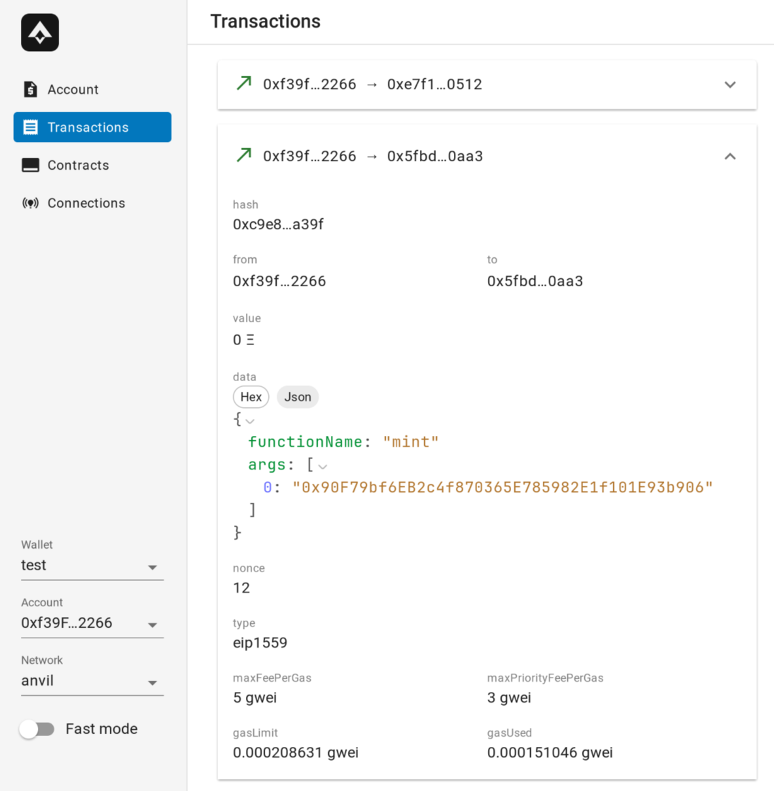

# ethui 0.7.0 - ETH Lisbon

The past couple of months have been focused on ironing out (pun very much intended) a lot of bugs and nuances in the application, and making the new version feel as smooth and intuitive as possible.

Along the way, there are some great quality-of-life features now available in 0.7.0. Read on to know more!

<Embed url="https://github.com/iron-wallet/iron/releases/tag/v0.7.0" />

## First of all - ETH Lisbon & Bounties

[The event](https://ethlisbon.org/) starts tomorrow, hosting hundreds of builders for 48 hours of non-stop hacking. We’ll be there. Iron will have a workshop on the first day, and we invite participants to use it when building their own projects.

Additionally, we also snuck in a [few bounties ourselves,](https://ethlisbon.iron-wallet.xyz) so if you’re looking to hack something that can directly contribute to the next release, this is your chance to be paid along the way.

### Future bounties

ETH Lisbon will be a testing ground for this model. We have plans to open up additional bounties, for various levels and skill sets, on platforms such as [OnlyDust](https://www.onlydust.xyz/).

## What’s new in 0.7.0?

### HTTP API

One of the long-running tasks we discussed early on was the ability to interact with the wallet in a headless/automated way.

You now have access to a set of HTTP endpoints for some select features:

* Submitting transactions (going through the same confirmation flow as a browser interaction would)

* Simulating transactions

* Querying the name & ABI of contracts found within your filesystem

As a basic example, here’s how you would simulate a transaction:

```bash
curl \
  -H "Content-Type: application/json" \
  -d '{"chainId": 31337, "request": {
    "from": "0xf39Fd6e51aad88F6F4ce6aB8827279cffFb92266",
    "to": "0x5fbdb2315678afecb367f032d93f642f64180aa3",
    "data": "0x6a627842000000000000000000000000f39fd6e51aad88f6f4ce6ab8827279cfffb92266",
    "gasLimit": 669107
}}' \
  http://localhost:9003/iron/transactions/simulate | jq
```

You specify the target chain, and the transaction parameters (as you would for a regular transaction). This can be coupled with tools such as [cast](https://book.getfoundry.sh/cast/) to provide automatic ABI encoding, although that’s something we intend to provide in the future. As a result, you get a response that includes all details about the execution:

```
{
  "simulationId": 1,
  "gasUsed": 151346,
  "blockNumber": 4,
  "success": true,
  "trace": [
    {
      "callType": "CALL",
      "from": "0x0000000000000000000000000000000000000000",
      "to": "0x0000000000000000000000000000000000000000",
      "value": "0x0"
    }
  ],
  "logs": [
    {
      "address": "0x5fbdb2315678afecb367f032d93f642f64180aa3",
      "topics": [
"0xddf252ad1be2c89b69c2b068fc378daa952ba7f163c4a11628f55a4df523b3ef",
"0x0000000000000000000000000000000000000000000000000000000000000000",
"0x000000000000000000000000f39fd6e51aad88f6f4ce6ab8827279cfffb92266",
"0x0000000000000000000000000000000000000000000000000000000000000005"
      ],
      "data": "0x"
    }
  ],
  "exitReason": "Stop",
  "returnData": "0x"
}
```

This is already being used internally by Iron to power the transaction review dialog, where you can debug the outgoing logs before confirming a transaction.

### Transaction View

The UI now includes full details of a past transaction, with a JSON view included that shows you the decoded calldata, as long as an ABI for that contract is known.



### Fast mode

As you can see in the sidebar on the previous screenshot, you can easily toggle the new “Fast mode”.

What is “Fast mode” you now ask? It toggles the ability to skip transaction & signature confirmations. This only affects anvil networks + plaintext wallets, for security reasons, but it does allow for very fast feedback loops when building a website, while still allowing the ability to debug specific transactions when needed.

## And much more

This release is by far our largest in terms of work hours and merged contributions. Most of those are the quiet type, such as bugfixes, and incremental UI improvements.

But don’t let that fool you, see the [changelog](https://github.com/iron-wallet/iron/releases) for yourself. And do try out the wallet!

[TODO](http://github.com/iron-wallet/iron)
