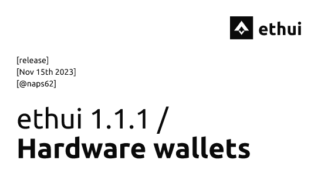

import ledger from './ledger.mp4';
import devtools from './devtools.mp4';

# ethui 1.1.1 – Ledger & Devtools

Recently, during [ETH Lisbon](https://ethlisbon.org/), we quietly released 1.0.0. This was not your typical newsworthy 1.0 release, but rather a breaking-change for a [tedious bugfix](https://github.com/iron-wallet/iron/pull/482).

This time, we’ve got some juice.

Iron Wallet 1.1.1 brings three major functionalities, read on for the updates, or download the latest release:

<Embed url="https://github.com/iron-wallet/iron/releases/tag/v1.1.1" />

## Ledger support

One of the few things still forcing me to use other wallets was the need to use my hardware wallet—no more.

Now USB ledgers are fully supported as a signer on the wallet.

Keep in mind that it’s a fresh new feature, so some behaviors may be finicky, but since Ledgers themselves provide security, this is a safe feature to expose and iterate on.

When comparing to MetaMask’s ledger support, a few key advantages stand out:

* Easier to add multiple addresses (although you currently need to input the raw derivation path. We’ll improve that UX soon)

* Transactions are not immediately rejected if you start one without having your ledger available. Instead, the review dialog will wait until your device is ready (unlocked & with the Ethereum app open)

<Video controls src={ledger} />

## Devtools panel

One of the things we’ve wanted for a long time was the ability to debug RPC calls from a browser tab the same way we debug network requests: by having full access to them in the browser’s devtools, scoped to each tab.

That’s finally available today:

<Video controls src={devtools} />

This task was also the result of our bounties published at [ETH Lisbon](https://ethlisbon.org/). congrats to [@PolpEdu](https://github.com/PolpEdu) for getting the work going and winning our bounty!

## Onboarding flow

From now on, when running the Wallet for the first time, you’ll be greeted with a small setup screen that will walk you through some necessary steps. This includes mainly setting up an alchemy.com API key (required for mainnet indexing), and setting up the browser extension)

Like the previous feature, this was also spearheaded by a first-time contributor, our apprentice [Pedro Ferreira](https://github.com/pferreira101)!

## Live on Gitcoin 19

The latest Gitcoin round is now live, and Iron Wallet is up in the Web3 Open source category. so if the project has been of use to you, [consider supporting it](https://explorer.gitcoin.co/#/round/424/0xd4cc0dd193c7dc1d665ae244ce12d7fab337a008/0xd4cc0dd193c7dc1d665ae244ce12d7fab337a008-94)

Or just go say hi to us in DevConnect & [WalletUncon](https://twitter.com/walletuncon). We don’t bite.

<Embed url="https://ethui.dev" />
