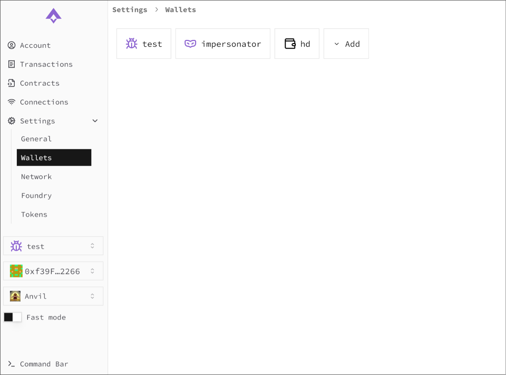
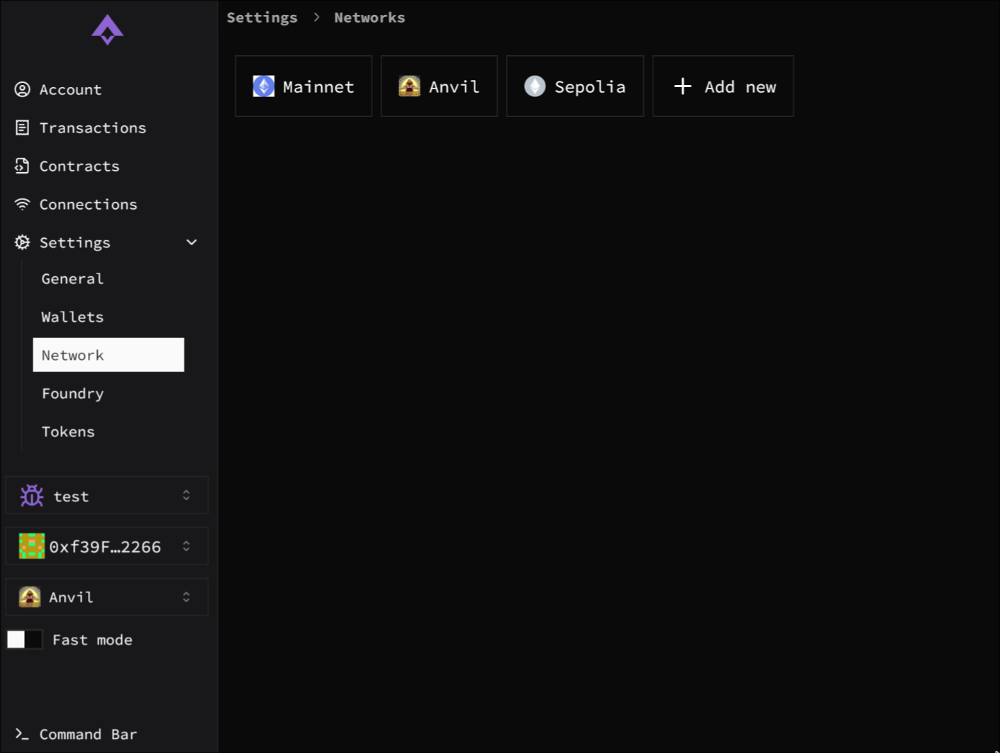
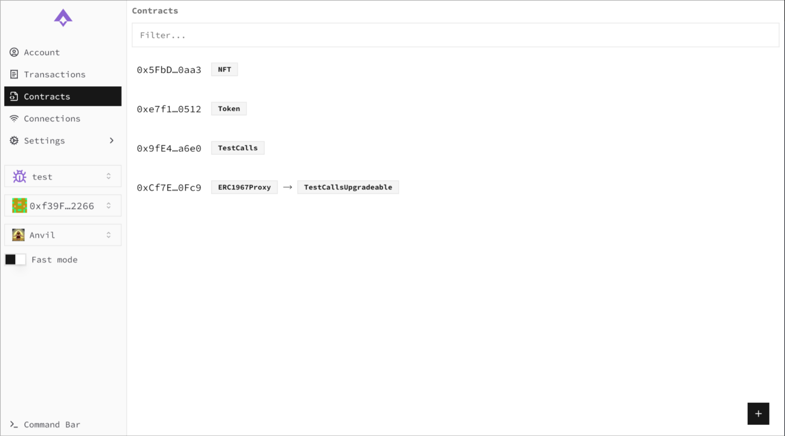

# ethui 1.13.0 – We're back

We’re finally getting back in full force!

2025 will the year where we push hard to make ethui the most powerful and developer-friendly tool to use when building for web3.

<Embed url="https://github.com/ethui/ethui/releases/tag/v1.13.0" />

The new release comes with some changes that have been brewing for some time:

## Revamped UI

We moved away from Mui’s [Material UI](https://mui.com/material-ui/) into a [shadcn](https://ui.shadcn.com/) based component library, and also took the chance to clean up and polish the entire UI. The end result is cleaner, snappier, and much more enjoyable to use (and the code is greatly simplified too).

Specific adjustments have also been made for macOS users to get more of the native feel they’re expecting.

## Proxy contracts are now support

The contract explorer tool now supports all major standards for proxy contracts, by allowing you to interact with proxies using their implementation’s ABI rather than the proxy itself.

This work was built as a separate [proxy-detect](https://github.com/ethui/proxy-detect) crate, which is itself a re-implementation of an [existing Typescript package](https://github.com/abipub/evm-proxy-detection).

## Remote anvil instances

A lot of changes and optimizations have been built to enable a rather powerful use case: you can now host your own anvil instances remotely, even using non-standard chain IDs, and ethui will properly sync with them in realtime, just like it did previously with local ones.

We at Subvisual have been using this feature internally across our web3 projects, by hosting our own private testnet for each project, and using ethui to connect to it.

## Safer and faster anvil interactions

Whenever you interact with an `anvil` chain, all your transactions will now be impersonated by default, all thanks to [anvil’s cheatcodes](https://book.getfoundry.sh/reference/anvil/#custom-methods), which we’ve incorporated into our transaction flow.

This means you can now use Fast Mode and skip dialogs and password checks, even when using your actual password-protected HD Wallet to test a contract.

Since you never end up decrypting your private key, or signing any message, this ends up as an even safer way than the default behavior.

## New website & docs

Previously, the only written documentation were these blog posts. We’ve now compiled some of the main features and highlights into our own website:

<Embed url="https://ethui.dev" />

## Become a user / contributor

The new release can be downloaded from [our website](https://ethui.dev/), or directly from [github’s releases](https://github.com/ethui/ethui/releases/tag/v1.13.0). You can also [build directly from source](https://github.com/ethui/ethui).

As always, feedback and contributions are most welcome!

<Embed url="https://github.com/ethui/ethui/releases/tag/v1.13.0" />
