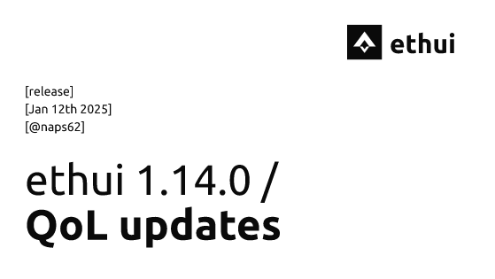
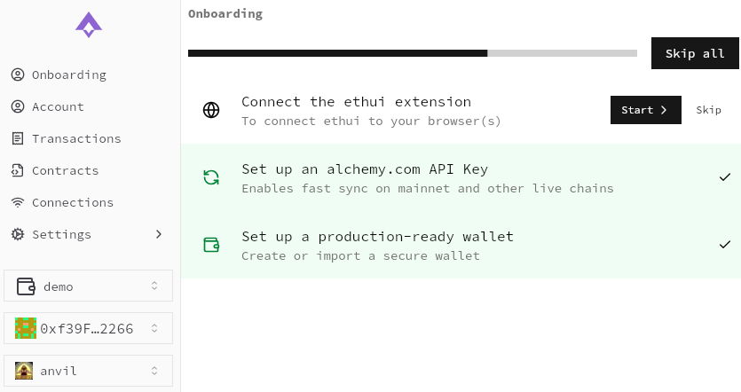
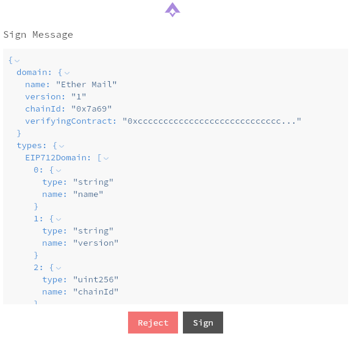

# ethui 1.14.0

We’re happy to announce the new ethui 1.14.

This is a smaller release with a lot of quality-of-life improvements, and a couple of new features.

<Embed url="https://github.com/ethui/ethui/releases/tag/v1.14.0" />

## New onboarding flow

We previously enforced an onboarding flow when first opening the app. It was, however, limited for a couple of reasons:

- It wasn't suited for highlighting new features to existing users that had already marked the onboarding as complete;
- It was unnecessarily intrusive, since most of existing prompts were optional, and prevented users from reaching the app quickly.

Instead, you'll now see a new Onboarding tab on the main screen, with optional steps you can take to both get to know the app and setup optional tools. Once you dismiss it, it may show up in future releases, if worthwhile features are announced there

## Improved JSON view for message signing

When signing messages, JSON content will now be displayed in a more structured way

## Become a user / contributor

The new release can be downloaded from [our website](https://ethui.dev/), or directly from [github’s releases](https://github.com/ethui/ethui/releases/tag/v1.14.0). You can also [build directly from source](https://github.com/ethui/ethui).

As always, feedback and contributions are most welcome!

<Embed url="https://github.com/ethui/ethui/releases/tag/v1.14.0" />
