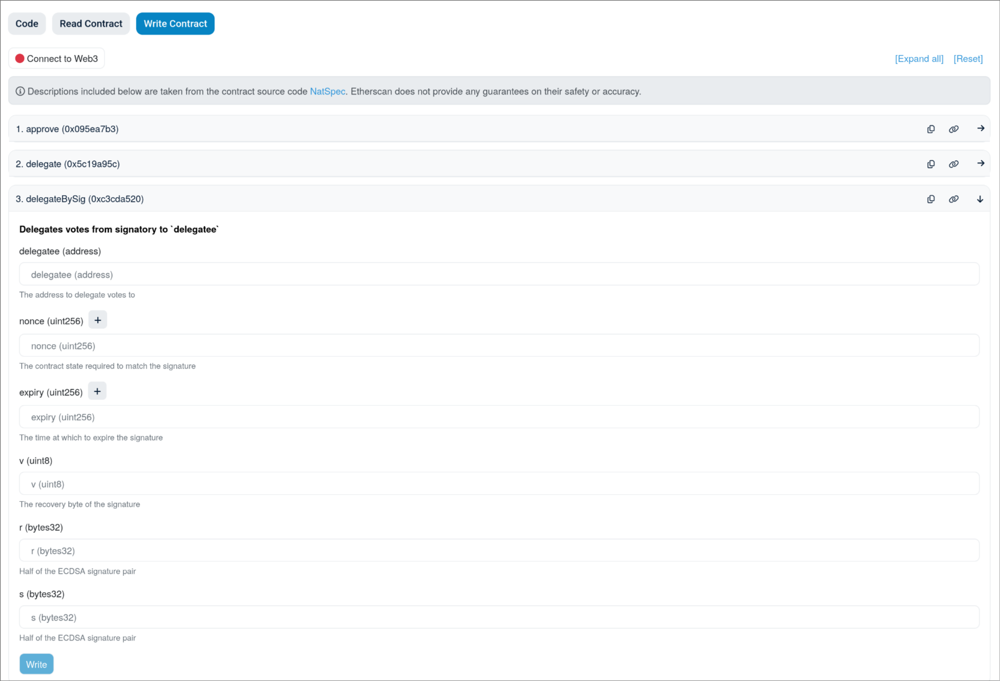

[explorer]: https://explorer.ethui.dev
[anvil]: https://getfoundry.sh/anvil/overview
[ethui]: https://ethui.dev
[storybook]: https://storybook.ethui.dev
[otterscan]: https://otterscan.io/
[persisted-anvil]: https://github.com/naps62/persisted-anvil

# Announcing ethui's explorer

Today we're announcing a new tool we've been working on: a local-first Ethereum explorer:

<Embed url="https://explorer.ethui.dev" />

You can connect it to any Ethereum RPC, but it shines the most when used with [Anvil][anvil] nodes, and with [ethui][ethui] as the connected wallet.

## First things first, how do I use it?

The easy way: you go to [https://explorer.ethui.dev/](https://explorer.ethui.dev/) and connect to your Anvil node.

The slightly less easy way: clone and run the source at [https://github.com/ethui/explorer](https://github.com/ethui/explorer).

## Why?

Our explorer has a narrow focus: [Anvil][anvil] nodes, running either locally or remotely (as a private testnet). Connections to regular RPCs will work, but with limited functionality (we rely on the `ots_*` namespace, so Erigon nodes should actually work too).
With it, you can quickly inspect anvil instances, navigate through addresses, contracts and transactions. And more importantly, you can interact with contracts, just as you would with ethui itself:

## What's wrong with existing explorers?

There are so many blockchain explorers out there, but most of them several major shortcomings for developers:
- They only work on live chains;
- As a consequence, they require you to externally verify your smart contracts if you are to interact with them;
- They require an indexing backend and other infrastructure, which makes them more cumbersome to even attempt to run locally.
- The UI is often severely limited.

As a result, they're often used as a crutch for when things are already deployed but some quick debugging is needed, or for when you need that one transaction that you haven't bothered to implement the UI for yet.

Who among us hasn't had to withdraw some funds from a contract, or revoke a compromised wallet's role, through something like this?

It also doesn't help that the most popular explorer, Etherscan, has a pretty limited web3 login system, making a lot of wallets unable to connect.

## What about Otterscan?

This is a hugely popular open-source effort, Otterscan, attempting to replicate Etherscan's functionality in a [local and private environment][otterscan]:

However, for development workflows, it has some drawbacks of it's own:

- Setup is a bit cumbersome. e.g.: see an early attempt we did to create a reproducible full-stack private testnet [here][persisted-anvil] (with subgraph, explorer and everything);
- ABI availability requires setup of a local verifier too (Sourcify), and requires an integration into our Foundry deploy workflows;
- Crucially, no equivalent to the "Write Contract" feature of Etherscan. We can only perform read queries, and broadcast raw payloads.

Using Otterscan as a base was also not an easy option, as it uses an incompatible stack compared to ours (`ethers.js`-based vs `viem`-based).

The groundwork for this started a while ago, with the extraction of ethui's style system to a [separate system][storybook]

Ultimately, these are two projects with similar privacy concerns, but different end-goals. We highly appreciate the work done by Otterscan, and this is by no means an attempt to replace it.

## Give it a try

Head over to [https://explorer.ethui.dev/](https://explorer.ethui.dev/) and see how it works with your own local setup. We'd love to hear your feedback via [Github](https://github.com/ethui/explorer/issues) or [Twitter](https://twitter.com/ethuidev).

Let's all make Ethereum development a little more comfortable for everyone!
